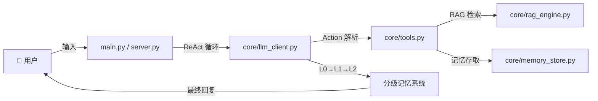

<p align="center">
  <h1 align="center">🤖 Chatbot — 工业级 AI Agent 学习项目</h1>
  <p align="center">
    从零开始的 Agent 进化之路：ReAct · RAG · 分级记忆 · 工具调用
  </p>
</p>

<p align="center">
  
  
  
  
  
  
  
</p>

---

## 📖 项目简介

这是一个面向 **Agent 零基础学习者** 的工业级 AI Agent 实操项目。项目从最基础的 LLM 封装开始，逐步迭代到具备 **ReAct 推理循环**、**分级记忆系统**、**RAG 知识库检索** 和 **长期语义记忆** 的完整 Agent 架构。

> 配套文档：`Agent_v1_to_v7_Journey.pptx` 完整记录了从 v1 到 v7 的演进过程。

## ✨ 核心特性

- **🧠 ReAct Agent 循环** —— Thought → Action → Observation → Answer，最多 3 轮迭代，避免死循环
- **🪜 三级分层记忆系统 (v7.0)**
  - **L0 短期记忆**：保留最近 10 轮对话，满后触发压缩
  - **L1 阶段摘要**：存储 10 个阶段性总结，满后触发全局压缩
  - **L2 全局共识**：单条核心摘要，永不丢失的关键信息
- **📚 RAG 知识库检索** —— 本地 `.txt` 文档 → 切片 → 向量化 → ChromaDB → 语义搜索
- **💾 长期语义记忆** —— 独立向量集合，保存用户偏好和个人信息，跨会话持久化
- **🔧 6 个内置工具**
  - `calculate` — 安全数学计算
  - `get_current_time` — 系统时间查询
  - `search_knowledge` — 知识库语义检索
  - `save_memory` / `recall_memory` / `list_all_memories` — 长期记忆管理
- **🖥️ 双界面支持** —— 命令行 (CLI) + Web 可视化 UI（含实时记忆监控面板）
- **🏠 完全本地运行** —— 基于 Ollama，数据不出本机，隐私有保障

## 🏗️ 项目架构

```
chatbot_v1/
├── main.py                  # CLI 入口 (v6.0)
├── server.py                # FastAPI Web 服务 (v7.0)
├── config/
│   └── settings.py          # 集中配置 (模型、地址、温度)
├── core/
│   ├── llm_client.py        # LLM 客户端 + 三级记忆系统
│   ├── rag_engine.py        # RAG 引擎 (文档加载 → 切片 → 向量检索)
│   ├── memory_store.py      # 长期语义记忆存储 (ChromaDB)
│   └── tools.py             # 工具注册表与实现
├── knowledge/
│   └── my_info.txt          # 私有知识库文档
├── static/
│   └── index.html           # Web UI (Tailwind + 记忆面板)
└── requirements.txt
```

### 数据流



## 🚀 快速开始

### 前置条件

- **Python 3.10+**
- **[Ollama](https://ollama.com)** 已安装并运行在 `http://localhost:11434`
- 已拉取所需模型（默认使用 `gemma4:31b-cloud`）

### 1. 克隆仓库

```bash
git clone https://github.com/你的用户名/chatbot_v1.git
cd chatbot_v1
```

### 2. 安装依赖

```bash
python -m venv venv
source venv/bin/activate   # Windows: venv\Scripts\activate
pip install -r requirements.txt
```

### 3. 配置环境

```bash
cp .env.example .env
# 编辑 .env，设置 OLLAMA_API_KEY（本地运行可留空）
```

在 `config/settings.py` 中确认或修改模型名称：

```python
MODEL_NAME = "gemma4:31b-cloud"   # 改成你已拉取的模型
```

### 4. 启动

**方式一：命令行交互**

```bash
python main.py
```

**方式二：Web 可视化界面**

```bash
python server.py
# 打开浏览器访问 http://localhost:8000
```

Web 界面提供实时记忆监控面板，可直观看到 L0/L1/L2 的状态变化。

## 🔧 可用工具一览

| 工具名 | 用途 | 调用示例 |
|--------|------|----------|
| `calculate` | 安全数学计算 | `Action: calculate(2**10 + math.sqrt(16))` |
| `get_current_time` | 获取系统时间 | `Action: get_current_time()` |
| `search_knowledge` | RAG 知识库检索 | `Action: search_knowledge("我的名字")` |
| `save_memory` | 保存长期记忆 | `Action: save_memory("用户喜欢爬山")` |
| `recall_memory` | 语义回忆 | `Action: recall_memory("用户喜欢的运动")` |
| `list_all_memories` | 列出所有记忆 | `Action: list_all_memories()` |

## ⚙️ 配置说明

所有配置集中在 `config/settings.py`：

| 配置项 | 默认值 | 说明 |
|--------|--------|------|
| `API_BASE_URL` | `http://localhost:11434/v1` | Ollama API 地址 |
| `MODEL_NAME` | `gemma4:31b-cloud` | 使用的模型 |
| `TEMPERATURE` | `0.7` | 生成温度 (0=严谨, 1=随机) |

## 🧪 知识库使用

将 `.txt` 文件放入 `knowledge/` 目录，启动时 RAG 引擎会自动索引。文件会被自动切片（chunk_size=300, chunk_overlap=50）并存入 ChromaDB。

## 📌 学习路径

这个项目按版本演进设计，建议按以下顺序理解代码：

| 版本 | 核心概念 | 关键文件 |
|------|----------|----------|
| v1-v3 | LLM 封装、系统提示词 | `core/llm_client.py` |
| v4-v5 | ReAct 循环、工具调用 | `core/tools.py`, `main.py` |
| v6 | RAG 知识库检索 | `core/rag_engine.py` |
| v7 | 分级记忆 + 长期语义存储 | `core/llm_client.py`, `core/memory_store.py`, `server.py` |

## 🤝 贡献

欢迎提 Issue 和 PR！这是一个学习项目，如果你发现了问题或有改进建议，请随时交流。

## 📄 License

MIT License — 自由使用、修改和分发。
