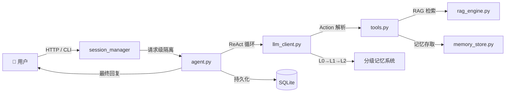

<p align="center">
  <h1 align="center">Enterprise AI Agent</h1>
  <p align="center">
    企业级智能客服 Agent：ReAct 推理 · RAG 知识检索 · 分级记忆 · 多用户隔离
  </p>
</p>

<p align="center">
  
  
  
  
  
  
</p>

---

## 项目简介

一个面向**企业知识服务场景**的 AI Agent 智能客服系统。Agent 基于 **ReAct（推理-行动）循环**自主决策工具调用，集成 **RAG 检索增强生成**实现私有文档的语义问答，设计了**三级分层记忆压缩机制**突破上下文窗口限制，并为每个用户建立独立的长期记忆存储，支持**多用户请求级隔离**。

> 配套演进文档：`Agent_v1_to_v7_Journey.pptx` 记录了从基础 LLM 封装到完整企业级 Agent 的全过程。

## 核心特性

- **ReAct Agent 循环** — Thought → Action → Observation → Answer，Agent 自主决定何时调用工具，最多 3 轮迭代
- **三级分层记忆系统**
  - **L0 短期记忆**：最近 10 轮对话，满后触发 L1 压缩
  - **L1 阶段摘要**：10 个阶段性总结，满后触发 L2 全局压缩
  - **L2 全局共识**：单条核心摘要，永不丢失的关键信息
- **RAG 知识库检索** — 支持**热加载**（运行时增删文档，无需重启） + **答案溯源**（响应标注引用来源和相似度分数）
- **多用户并发隔离** — 基于 SessionManager 的请求级 Agent 实例隔离 + ChromaDB 按用户命名空间分区，用户间对话和记忆完全独立
- **会话持久化** — SQLite 存储对话历史，服务重启后自动恢复上下文
- **结构化错误响应** — 统一的 JSON 错误格式（错误码 + 详情 + request_id），FastAPI 全局异常处理器
- **系统提示词外置化** — 支持从文件加载，可按客户/租户定制 Agent 人设
- **6 个内置工具** — 数学计算、时间查询、知识库检索、长期记忆存取
- **双界面** — CLI 命令行 + Web 可视化 UI（Tailwind CSS + 实时记忆监控面板）

## 项目架构

```
├── pyproject.toml                # 工程打包、依赖锁定
├── .env.example                  # 环境变量模板
├── prompts/
│   └── system_prompt.txt         # 系统提示词（可按租户定制）
├── knowledge/                    # 私有知识库文档目录
│
├── src/chatbot/                  # 正规 Python 包
│   ├── exceptions.py             # 自定义异常层级（7 类，含错误码）
│   ├── logging_config.py         # 统一日志系统（控制台 + 文件轮转）
│   ├── config/
│   │   └── settings.py           # 集中配置（30+ 可配置项，env 可覆盖）
│   ├── core/
│   │   ├── agent.py              # ReAct Agent 循环引擎
│   │   ├── llm_client.py         # LLM API 客户端 + 三级记忆管理
│   │   ├── rag_engine.py         # RAG 知识库引擎（文档加载 → 切片 → 向量检索）
│   │   ├── memory_store.py       # 长期语义记忆存储（按用户隔离）
│   │   ├── tools.py              # 工具注册表 + 用户绑定 ToolExecutor
│   │   ├── session_manager.py    # 多用户会话生命周期管理（线程安全）
│   │   ├── persistence.py        # 会话持久化层（SQLite）
│   │   └── user_context.py       # 用户上下文数据类
│   ├── api/
│   │   └── server.py             # FastAPI 服务端（11 个端点）
│   └── cli/
│       └── main.py               # CLI 命令行入口
│
├── static/index.html             # Web 可视化 UI
│
└── tests/                        # 测试套件（48 个测试）
    ├── conftest.py               # FakeLLMClient + fixtures
    ├── core/                     # Agent / LLM / RAG / Memory / Persistence 测试
    └── api/                      # HTTP 端点测试
```

### 数据流



## 快速开始

### 前置条件

- **Python 3.10+**
- **LLM API 服务**：任何 OpenAI 兼容的 API 端点（如 [Ollama](https://ollama.com)、vLLM、OpenAI 官方等）
- 已拉取所需模型（默认配置 `gemma4:31b-cloud`，可改为任何模型）

### 1. 克隆仓库

```bash
git clone https://github.com/你的用户名/chatbot_v1.git
cd chatbot_v1
```

### 2. 安装依赖

```bash
python -m venv venv
source venv/bin/activate        # Windows: venv\Scripts\activate
pip install -e ".[dev]"          # -e 可编辑安装，dev 含测试工具
```

### 3. 配置

```bash
cp .env.example .env
# 编辑 .env，设置 API 地址和模型名称
```

关键配置项：

| 环境变量 | 默认值 | 说明 |
|----------|--------|------|
| `OLLAMA_BASE_URL` | `http://localhost:11434/v1` | LLM API 端点 |
| `OLLAMA_MODEL` | `gemma4:31b-cloud` | 使用的模型名称 |
| `LOG_LEVEL` | `INFO` | 日志级别 |
| `EMBEDDING_MODEL` | `all-MiniLM-L6-v2` | 向量嵌入模型 |

提示词在 `prompts/system_prompt.txt`，可直接编辑定制 Agent 人设。

### 4. 启动

**方式一：Web 服务**

```bash
python -m chatbot.api.server
# 浏览器访问 http://localhost:8000
# API 文档 http://localhost:8000/docs
```

**方式二：命令行交互**

```bash
python -m chatbot.cli.main
```

### 5. 多用户测试

```bash
# 用户 Alice
curl -H "X-User-Id: alice" -X POST http://localhost:8000/chat \
  -H "Content-Type: application/json" \
  -d '{"message": "我叫 Alice"}'

# 用户 Bob（完全隔离，不知道 Alice 是谁）
curl -H "X-User-Id: bob" -X POST http://localhost:8000/chat \
  -H "Content-Type: application/json" \
  -d '{"message": "我叫什么名字？"}'
```

## API 端点

| 端点 | 方法 | 说明 |
|------|------|------|
| `/health` | GET | 服务健康检查（LLM + ChromaDB 连通性） |
| `/status` | GET | 当前用户内存状态（L0/L1/L2） |
| `/chat` | POST | **核心聊天接口**，含 RAG 溯源 + Token 统计 |
| `/clear` | POST | 清空当前用户所有记忆 |
| `/knowledge` | GET | 列出知识库文档 |
| `/knowledge` | POST | 热添加文档（运行时生效，无需重启） |
| `/knowledge/reload` | POST | 热重载知识库索引 |
| `/knowledge/{name}` | DELETE | 删除指定文档 |
| `/conversations` | GET | 当前用户历史对话列表 |
| `/conversations/{id}/messages` | GET | 指定对话的完整消息历史 |
| `/conversations/{id}/close` | POST | 关闭（归档）一个对话 |

### 错误响应格式

所有错误返回统一的 JSON 结构：

```json
{
  "error": {
    "code": "LLM_CLIENT_ERROR",
    "message": "LLM API 连接超时",
    "details": {
      "url": "http://localhost:11434/v1",
      "timeout": 30
    }
  },
  "request_id": "a1b2c3d4"
}
```

## 可用工具

| 工具名 | 用途 | Agent 调用示例 |
|--------|------|---------------|
| `calculate` | 安全数学计算 | `Action: calculate(2**10 + math.sqrt(16))` |
| `get_current_time` | 获取系统时间 | `Action: get_current_time()` |
| `search_knowledge` | RAG 知识库检索 | `Action: search_knowledge("退货政策")` |
| `save_memory` | 保存长期记忆 | `Action: save_memory("客户偏好邮件通知")` |
| `recall_memory` | 语义回忆 | `Action: recall_memory("客户联系方式偏好")` |
| `list_all_memories` | 列出所有记忆 | `Action: list_all_memories()` |

## 运行测试

```bash
pytest tests/ -v
# 48 passed
```

## 技术栈

`Python 3.10+` `FastAPI` `OpenAI SDK` `LangChain` `ChromaDB` `SQLite` `HuggingFace Embeddings` `Pydantic` `pytest` `Tailwind CSS`

## License

MIT License
